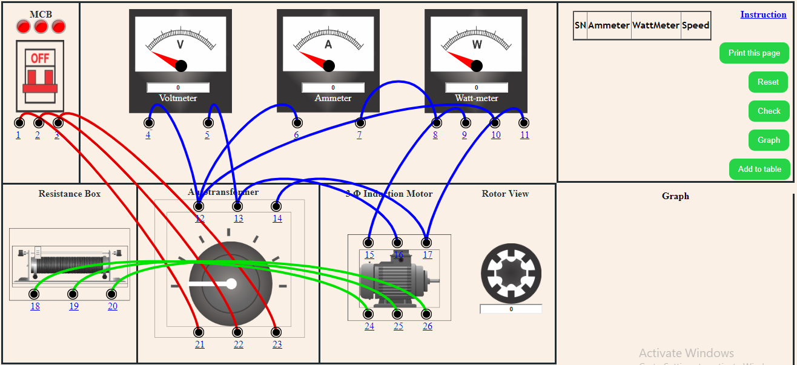

Step 1: </B>Make the proper connection by clicking the node as instructed below. If the wire is misplaced, click the node number to deattach the nodes' wire.  
                    <table>
                        <tr>
                            <td><B>From</B></td>
                            <td>1</td>
                            <td>2</td>
                            <td>3</td>
                            <td>4</td>
                            <td>5</td>
                            <td>6</td>
                            <td>7</td>
                            <td>9</td>
                            <td>10</td>
                            <td>11</td>
                            <td>16</td>
                            <td>17</td>
                            <td>18</td>
                            <td>19</td>
                            <td>20</td>
                        </tr>
                        <tr>
                        <td><B>To</B></td>
                            <td>21</td>
                            <td>22</td>
                            <td>23</td>
                            <td>12</td>
                            <td>13</td>
                            <td>12</td>
                            <td>8</td>
                            <td>15</td>
                            <td>12</td>
                            <td>17</td>
                            <td>13</td>
                            <td>14</td>
                            <td>24</td>
                            <td>25</td>
                            <td>26</td>
                        </tr>
                    </table>

 

Step 2: </B>Click "Check" button. 
    1. if connection is correct, an alert appers. Click ok. Now, go to step 4.  
    2. if connection is wrong, an alert appers. Click ok. Now, go to step 3. 
Step 3: </B>Check the connection and either deattach the incorrect wire connection or Click on reset button and start from step 1. 
Step 4: </B>Switch on the MCB. 
Step 5: </B>Click anywhere on the autotransformer. 
Step 6: </B>Slide the knob of the Rheostat to change the resistance. 
Step 7: </B>Take readings from Rotor, Voltmeter, Ammeter and Watt-meter. 
Step 8: </B>Click "Add to table" button to insert the values in table. 
Step 9: </B>Follow the procedure from step 6 to step 8, till you have the 6 readings on table. 
Step 10: </B>After taking minimum 6 readings, click the "Graph" button. 
Step 11: </B> Click "Print" button, to print the full connections with graph and table. 
