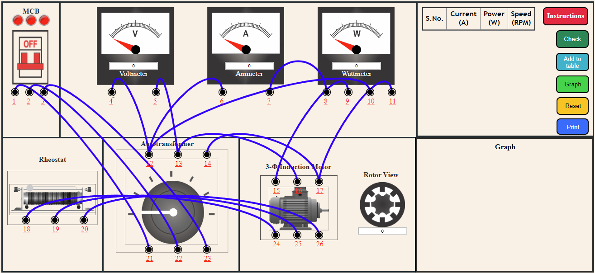

<b>STEP 1: </b>Make connections as per the instructions given below. If the wire is wrongly connected, Click on node number to detach the wire. 
                    
<table>
                        <tr>
                            <td style="border:1px solid black;"><b>From</b></td>
                            <td style="border:1px solid black;">1</td>
                            <td style="border:1px solid black;">2</td>
                            <td style="border:1px solid black;">3</td>
                            <td style="border:1px solid black;">4</td>
                            <td style="border:1px solid black;">5</td>
                            <td style="border:1px solid black;">6</td>
                            <td style="border:1px solid black;">7</td>
                            <td style="border:1px solid black;">9</td>
                            <td style="border:1px solid black;">10</td>
                            <td style="border:1px solid black;">11</td>
                            <td style="border:1px solid black;">16</td>
                            <td style="border:1px solid black;">17</td>
                            <td style="border:1px solid black;">18</td>
                            <td style="border:1px solid black;">19</td>
                            <td style="border:1px solid black;">20</td>
                        </tr>
                        <tr>
                            <td style="border:1px solid black;"><b>To</b></td>
                            <td style="border:1px solid black;">21</td>
                            <td style="border:1px solid black;">22</td>
                            <td style="border:1px solid black;">23</td>
                            <td style="border:1px solid black;">12</td>
                            <td style="border:1px solid black;">13</td>
                            <td style="border:1px solid black;">12</td>
                            <td style="border:1px solid black;">8</td>
                            <td style="border:1px solid black;">15</td>
                            <td style="border:1px solid black;">12</td>
                            <td style="border:1px solid black;">17</td>
                            <td style="border:1px solid black;">13</td>
                            <td style="border:1px solid black;">14</td>
                            <td style="border:1px solid black;">24</td>
                            <td style="border:1px solid black;">25</td>
                            <td style="border:1px solid black;">26</td>
                        </tr>
</table>

                    
<b>STEP 2: </b>Click on <b>"Check"</b> button for checking the connections.
<li>if connection is correct, an alert appears. Click ok. Now, go to step 4.</li>
<li>if connection is wrong, an alert appears. Click ok. Now, go to step 3.</li> 
<b>STEP 3: </b>Check the connection and either detach the incorrect wire connection or Click on Reset button and start from step 1.  
<b>STEP 4: </b>Switch on the MCB.  
<b>STEP 5: </b>Click on the autotransformer knob.  
<b>STEP 6: </b>Slide the knob of the Rheostat to change the resistance.  
<b>STEP 7: </b>Click on <b>"Add to table"</b> button to insert the readings in the table.  
<b>STEP 8: </b>Follow the procedure from step 6 to step 7, till you have the 6 readings in the table.    
<b>STEP 9: </b>After taking minimum 6 readings, Click on the <b>"Graph"</b> button.  
<b>STEP 10: </b>Click on <b>"Print"</b> button to print the full connections with graph and table.