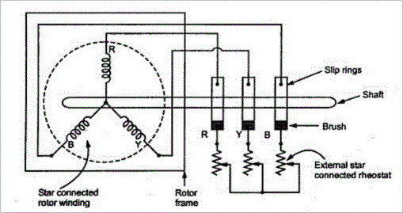

### Introduction

A wound rotor induction motor or slip ring induction motor has a stator like the squirrel cage induction motor, but a rotor with insulated windings brought out via slip rings and brushes. However, no power is applied to the slip rings. Their sole purpose is to allow resistance to be placed in series with the rotor windings while starting. 

 
<b>Figure : Equivalent circuit of slip ring induction motor.</b>

### Slip Ring Characteristcs 

A slip ring motor or a phase wound motor is an induction motor which can be started with full line voltage, applied across its stator terminals. The rotor winding terminals of a wound rotor motor are connected to three slip-rings mounted on but insulated from the shaft. The leads, from the three brushes pressing on these slip-rings are taken to external resistances. At the time of start, the value of starting current is adjusted by adding up external resistance to its rotor circuit. As the rotor speeds up, the external resistance is decreased in steps so that motor torque tends to remain maximum during the accelerating period. Finally, under normal operation, the external resistance is fully cut off and the slip-rings are short-circuited so that motor now develop full load torque at low value of slip-rings. The point to be noted is the “slip necessary to generate maximum torque is directly proportional to the rotor resistance.” So it is evident that the slip increases with increase in external resistance.  
With the above statements, let us discuss the different methods of speed control of slip ring induction motors: 
1. Rotor Rheostat Control 
2. Cascade Control

### Speed Control by Rotor Rheostat Control

The external rheostat which is used for the starting purpose of these slip ring motors can be used for its speed control too. But the point to look into is the starting rheostat must be rated for “continuous” operation. With the same rheostat added to the rotor circuit, it is possible to regulate the speed of slip ring motors. The resistance is engaged maximum during starting and slowly cut-off to increase the speed of the motor. When running at full speed, if the need arises to reduce the speed, the resistance is slowly added up and thus speed reduces. To understand the speed control, let us look into the torque-slip relation given below. 
 

<b>Torque T = S/R</b>
 
Where,  
S – is the slip of the motor, 
R – is the Rotor resistance. 

It is evident from the above relation that as the rotor resistance increases, the torque decreases. But for a given load demand, the motor and thus the rotor has to supply the same torque without any decrease. So in order to maintain the torque constant, as the rotor resistance increases the slip also increases. This increase in slip is nothing but decrease in motor speed. 

### Disadvantages:
 
But there are some disadvantages in this method of speed control. As the rotor resistance is increased, the “I^2 * R” losses also increases which in turn decreases the operating efficiency of the motor. It can be interpreted as the loss is directly proportional to reduction in speed. Since the losses are more, this method of speed reduction is used only for short period only.